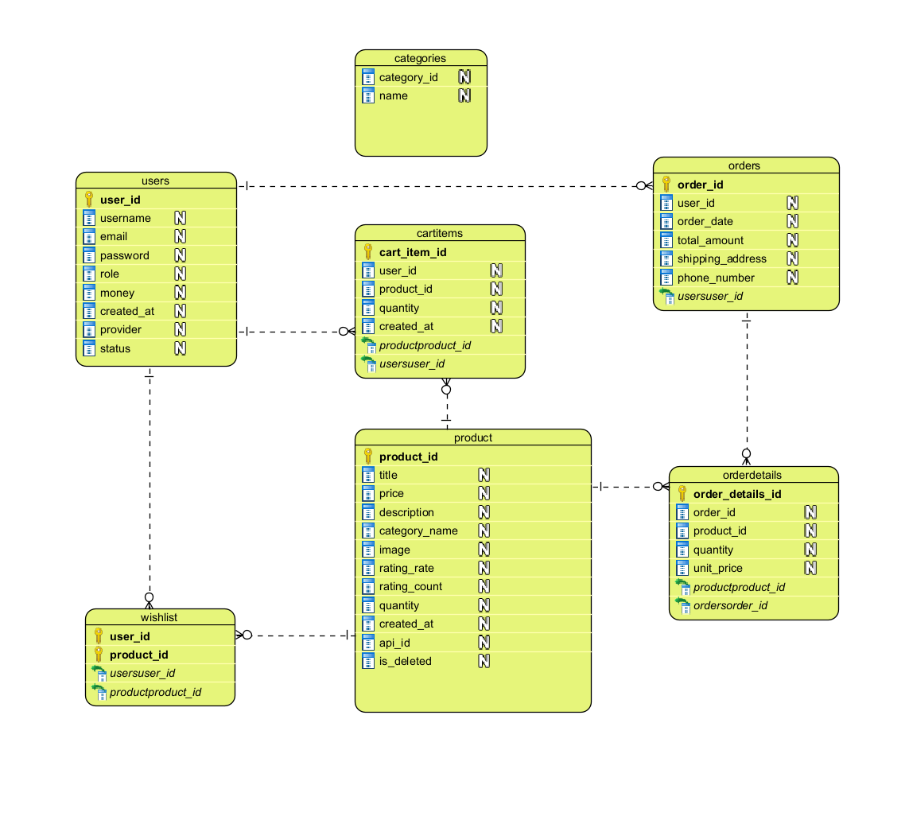

# 🛒 App Mua Sắm :HOBBEE

<p align="center">
  
  <br>
  <b>Ứng dụng Thương mại Điện tử Desktop chuyên nghiệp</b>
  <br>
  <i>Hobbee - Mua sắm thông minh, trải nghiệm tinh tế</i>
</p>

> **Mô tả:** Hệ thống mua sắm và quản lý giao dịch trực tiếp trên máy tính, tích hợp ví điện tử và hệ thống quản trị dành cho Admin.

---

## 📋 Hướng dẫn sử dụng
1. **Kết nối Internet:** Đảm bảo máy tính có mạng để truy cập Database (Local hoặc Online qua Clever Cloud).
2. **Khởi động:** Chạy dự án thông qua file `Main.java`.
3. **Đăng ký/Đăng nhập:** * Nếu chưa có tài khoản, hãy nhấn **Đăng ký** (Hỗ trợ liên kết Facebook, Google).
  * Sử dụng tính năng **Quên mật khẩu** nếu cần (Hỗ trợ qua Jakarta Mail).
4. **Trải nghiệm:** Duyệt sản phẩm, thêm vào giỏ hàng và tiến hành thanh toán.

---

## ✨ Các Tính Năng Chính

### 👤 Phân hệ Người dùng (User)
* **Xác thực đa năng:** Đăng ký, đăng nhập linh hoạt (Hệ thống, Google, Facebook).
* **Hồ sơ cá nhân:** Quản lý thông tin, cập nhật ảnh đại diện và theo dõi số dư.
* **Mua sắm & Thanh toán:** * Xem danh sách sản phẩm trực quan.
  * Quản lý giỏ hàng và thanh toán trực tuyến qua ví điện tử.
* **Tiện ích mở rộng:** * **Wishlist:** Lưu lại các sản phẩm yêu thích.
  * **Lịch sử:** Xem chi tiết giao dịch (Ngày giờ, đơn giá, trạng thái).

### 🛡️ Phân hệ Quản trị viên (Admin)
* **Quản lý người dùng:** Khóa, mở khóa hoặc xóa tài khoản.
* **Quản lý kho hàng:** Thêm, sửa, xóa thông tin sản phẩm.
* **Báo cáo thống kê:** Theo dõi doanh thu, sản phẩm đã bán và danh sách khách hàng.

### ⚙️ Đặc tính Hệ thống
* Hỗ trợ kết nối MySQL linh hoạt (Local/Cloud).
* Giao diện hiện đại, tối ưu hiệu suất với JavaFX CSS.

---

## 🛠 Công Nghệ Sử Dụng

### 💻 Backend & Core
* **Ngôn ngữ:** Java (JDK 21)
* **Quản lý dự án:** Maven
* **Cơ sở dữ liệu:** MySQL
* **Xử lý Email:** Jakarta Mail (Gửi/nhận email xác thực).
* **Thư viện bổ sung:** * `Lombok`: Giảm mã thừa (Getter/Setter).
  * `Gson`: Xử lý dữ liệu định dạng JSON.
  * `MySQL Connector`: Kết nối DB.

### 🎨 Giao diện & UI/UX (JavaFX 17)
* **FXML & Scene Builder:** Tách rời thiết kế và logic code.
* **JavaFX CSS:** Tùy biến giao diện (Button, TableView, Sidebar).
* **SVGPath:** Hiển thị Icon vector sắc nét.
* **Navigation Manager:** Quản lý chuyển cảnh tập trung, mượt mà.

---

## 📂 Cấu Trúc Thư Mục Dự Án
```text
AppThuongMai/
├── 📁 .idea/                   # Cấu hình môi trường phát triển (IDE)
└── 📁 src/main/
    ├── 📁 java/org/example/    # Mã nguồn Java chính
    │   ├── 📁 api/             # Giao tiếp dữ liệu bên ngoài
    │   ├── 📁 constant/        # Hằng số và cấu hình hệ thống
    │   ├── 📁 controller/      # Điều hướng và xử lý logic giao diện
    │   │   └── 📁 login_controller/ # Xác thực và chuyển màn hình
    │   ├── 📁 dao/             # Truy xuất DB (Data Access Object)
    │   ├── 📁 model/           # Các lớp thực thể dữ liệu
    │   ├── 📁 dto/             # Đối tượng truyền tải dữ liệu
    │   ├── 📁 service/         # Tầng xử lý nghiệp vụ trung gian
    │   └── 📁 utils/           # Các công cụ hỗ trợ (App, Main)
    └── 📁 resources/           # Tài nguyên hệ thống
        ├── 📁 asset/           # Hình ảnh, biểu tượng, tài nguyên tĩnh
        └── 📁 view/            # Các tệp giao diện người dùng (.fxml)
```
## 📂 Sơ đồ ERD
<p align="center">
  
</p>